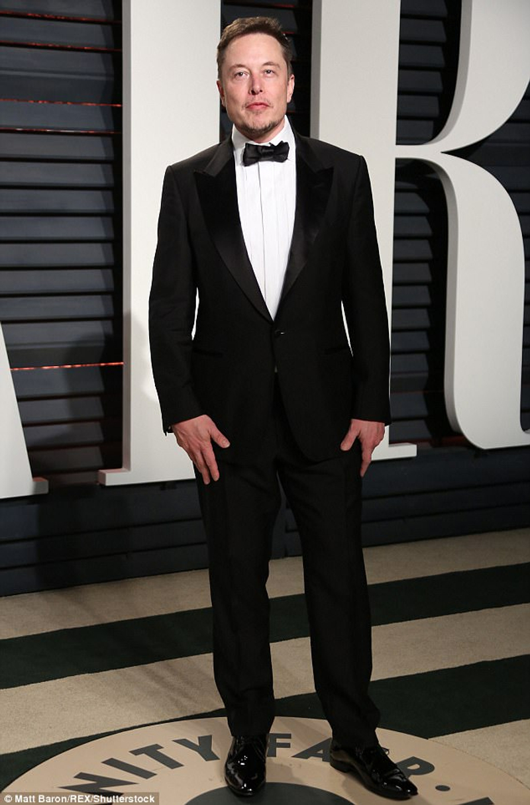

# Resume Photo Maker

[](https://huggingface.co/spaces/guocheng66/resume-photo-maker)

Make a resume photo with a simple python script and two lightweight deep neural networks.




## Set up and run
```bash
pip install -r requirements.txt

python resume_photo_maker.py --image images/elon.jpg --background_color 255 255 255
```
There is a live demo on Hugging Face.[Try it now](https://huggingface.co/spaces/guocheng66/resume-photo-maker).

## Acknowledgements
https://github.com/ShiqiYu/libfacedetection

https://github.com/PaddlePaddle/PaddleSeg/tree/release/2.9/contrib/PP-HumanSeg